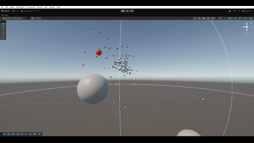

# 🐦 Boids Simulation

A school project made with **Unity 6** in order to reproduce the **Boids algorithm** — a simulation of flocking behavior inspired by birds and fish.  
The goal was to **learn how to manage object hierarchies, inheritance, and variations** entirely through **C# scripting**, without relying on Unity’s built-in components.

---

## 🎯 Project Goals

- Understand and implement **class inheritance** and object-oriented behavior in Unity  
- Control all parameters dynamically through the **Unity Inspector**  
- Recreate realistic flocking behavior (alignment, cohesion, separation, obstacle avoidance)  
- Experiment with **behavior variations** among agents  

---

## 🧠 Features

- **Core Boids Behaviors**
  - Separation, alignment, and cohesion  
  - Obstacle avoidance  
  - A moving obstacle ("Hunter") that chases nearby boids  

- **Special Boids**
  - 🟩 **Sticky Boids (Green):** tend to stay close to their neighbors  
  - 🟦 **Slow Boids (Blue):** move at reduced speed  
  - 🟨 **Enthusiastic Boids (Yellow):** move faster, sometimes leave the group, then return  
  - 🟥 **Leader Boid:** moves randomly within a defined zone and is followed by the rest of the flock  

- **Inspector Parameters**
  - Neighbor distance (perception radius)  
  - Cohesion, separation, and alignment forces  
  - Leader-following strength  

---

## ⚙️ Technical Details

- **Engine:** Unity 6  
- **Language:** C# only — no pre-made Unity components used  
- **Camera:** Fixed  
- **Optimization:** none (focus was on structure and behavior logic, not performance)  
- **Visuals:** minimal — purely functional simulation  

---

## 🎥 Preview

_(GIF placeholder — replace with your own demo once available)_



---

## 🚀 How to Run the Project

1. Clone or download the repository  
   ```bash
   git clone https://github.com/yumisakii/Boids.git

2. Open the project in Unity 6

3. Load the “Boids” scene (the only one in the project)

4. Press ▶️ Play to start the simulation

## 💡 What I Learned

- Applying **object-oriented design** (base class + derived classes) to agent behaviors.  
- Exposing parameters to the **Inspector** to iterate quickly on emergent behavior.  
- Understanding how **local steering rules** create **global emergent movement patterns**.  
- Organizing code for **readability** and **reusability** in Unity projects.

---

## 🔮 Future Improvements

- Implement **spatial partitioning** (grid / quadtree) for efficient neighbor queries.  
- Add **UI sliders** to tweak parameters in runtime without opening the Inspector.  
- Create a **WebGL build** and host it (Itch.io / GitHub Pages) for instant demo access.  
- Improve **visuals** (materials, trails) and add multiple **camera modes**.

---

## 👤 Author

**Jonathan de Vaulchier**  
🎮 Student Developer @ [Gaming Campus – G.Tech](https://gamingcampus.fr/ecoles/ecole-developpeur-jeux-video-g-tech.html)  
📧 [jonathan.devaulchier.dev@gmail.com](mailto:jonathan.devaulchier.dev@gmail.com)  
🔗 [GitHub Profile](https://github.com/yumisakii)
